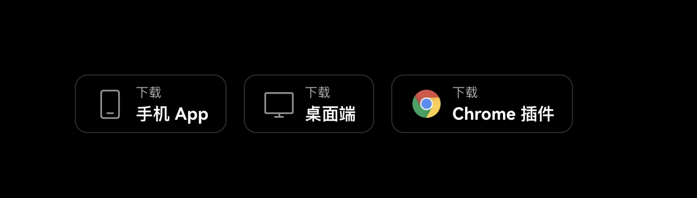

> 最近很多小伙伴的群聊都被铭文两个字攻陷，也有很多新的暴富神话层出不穷。
>
> 什么小学生买铭文财富自由啦
>
> 程序员写铭文工具一夜赚500w
>
> 等等等等，那么对于数藏人，如何最快的给自己的财富路径上加上铭文的选项呢？
>
> 圆桌｜铭文站系列，这就来了！

## 什么是铭文
> 铭文我知道啊，不就是这个么？
> 

NO，NO，NO！

今天我们说的是区块链比特币铭文。

### 铭文的起源

铭文：意味着在某物（如石头、硬币、平板等）上刻有文字。比特币铭文 就是刻在 **satoshi** 「比特币的最小单位，可以理解为1元等于100分，一比特币等于很多Saotoshi」上的**元数据**。

**比特币最小单位是聪（satoshi 即 sat）。**

1 枚比特币可分为 1 亿聪，每个聪都通过序数理论进行排序，有对应序数，是唯一编号。比特币铭文是指使用 Ordinals 协议将内容写入 satoshi 进行铭刻，形象理解就是你手里的一块钱和我手里的一块钱本来是一样的，但是一块钱的本质是一张纸，他可以承载信息。如果我把我手里的一块钱写上一段文字，这是Xuan的第xxx张一块钱，那么我手里的一块钱就变成独一无二的了。

怎么样，是不是和我们的小图片的理念很像，独一无二？

比特币铭文是一种利用新技术（Ordinals 协议）在比特币上创建的数字印记，如果将比特币比作数字黄金，那么铭文便是黄金饰品，它们共享相同的本质，铭文是指通过交易的见证数据部分将任意数据嵌入比特币区块链的过程。它类似于非同质化代币(NFT)，但与之不同的是，这些铭文直接刻在比特币区块链上。

这就是让Xuan错过第一波铭文的原因，因为当时我认为这一操作纯属脱裤子放屁。明明以太坊上的NFT就很不错了，为什么要在比特币上这样套娃一样的行为做比特币铭文。当然，后续大家也知道了，现实狠狠的给了我几个大耳光子！

### 比特币铭文的特点：

- 先到先得： 支付手续费越高越先处理；

- 独一无二：有人铭刻后后来者无法再铭刻；

- 相对公平：人人可mint，就看谁的眼光更准，手更快！

- 数量有限： 铭文铸造的时候可以限定数量，限定后就无法再次更改！

- 不可篡改：比特铭文并非是上传到 ipfs，而是刻在satoshi，无法篡改！
    特别注意，这里是真不可篡改，也就是为什么铭文和NFT不一样的地方。NFT的上链数据是一段网址，然后网址里保存着你的小图片。但铭文不一样，等于直接把你这份独一无二的内容上链。
  

### 铭文的玩法

- 铸造 铭刻代币或 NFT，可以尽量选择铸造有价值的，而不是随便一串数字or 小图片

- 打新 mint别人已经铸造好的代币，比拼的个人的眼光和手速

- 交易 和其他交易一模一样，高抛低吸

另外需要注意的一点，现在的铭文还是一个早期市场，大家没有一个统一的标准。任何人都可以发一个新的铭文和铭文协议，这也是圆桌布局的一个要点。要去找新的协议，碰到能被业界都认可的协议，那财富效应不亚于彩票中奖。

大家经常听到的奥迪，Ordi，其实就是使用了Oridinal协议的一个铭文。

其实Ordi协议还是有很大问题的，就比如说这些铭文如果不能上交易所就没有任何价值。所以我们要一起去埋伏有价值的协议。

就像以太坊为什么火爆，就是拓展了加密货币的可用性。以太坊之前加密货币只能交易，以太坊让整个区块链可编程，于是就是更多的应用，更多的生态，更多的消耗场景，进而推动以太坊代币的价格增长。

现在的Ordi协议下，铭文缺少的就是应用，如果有一个新的协议能够解决这些问题，那么必然是下一个以太坊一样的成就！此处广告一下，未来我们会带着大家不断埋伏新的协议里的龙头铭文，也欢迎大家积极来交流。

### Ordinals 协议的原理

Ordinals 协议是⼀个为聪编号的系统，为每个聪赋予⼀个序号，再附加上额外的数据（文本、图片、代码等），使每个聪都变成独一无二的 NFT，这个过程称之为“铭刻”。BRC-20 在 Ordinals 的基础上，⼜推出了类似 ERC-20 同质化代币的发行⽅法。

当下比特币铭文生态中三个知名度较高、有一定热度、价格又比较低廉的项目为例。这三个项目是Bitcoin Frogs（比特青蛙）、Goosinals（大鹅）、Bitcoin Punks（比特朋克）。

Bitcoin Punks被认为是比特币铭文中第一个10K类的头像类项目。它的图片主要来自以太坊的加密朋克。

Bitcoin Frogs（比特青蛙）是比特币生态中一个比较活跃的头像类项目，它除了使用青蛙这个具有一定迷因特征的形象之外，还加入了“稀有聪”的概念以进一步区分各个青蛙之间的稀有度。

Goosinals（大鹅）项目在一诞生就被注入了艺术品的基因，也被称为是比特币铭文生态的首个生成艺术品。以“艺术品”作为标签最大的好处是不再需要在玩法上进行太多的策划和运营，而只需要在艺术品这个共识上强化和发展。
铭文玩法的问题和发展

铭文问题的核心还是比特币扩容，本质还是大、小区块之争。 铭文当然是市场需求驱动的，但比特币毕竟是小杯子，铭文是杯子里玩龙卷风，硬挤必然导致正常交易被挤压。

区块链铭文作为区块链技术的一个重要应用，不仅为数字资产的管理和交易提供了新的可能，也为多个行业的发展带来了新的机遇。随着技术的不断进步，区块链铭文将在未来发挥更加重要的作用。

## 手把手教你打铭文（比特币铭文篇）
每一个链上的铭文都有自己的打铭文方式，今天第一天就让我们从最简单的用OK钱包打比特币铭文开始，学会操作，下次你就是那个获得千万倍收益的人。

### 所需材料
- 比特币
- 钱包
- 靠谱的代打平台

一，准备钱包

1. 打开OK浏览器<https://www.okx.com/cn/web3>
2. 选择左上角的Web3钱包

3. 点击下载钱包（建议用chrome插件）

4. 下载并且创建钱包（注意记住助记词）

二，准备比特币
5. 点击复制钱包地址
    
6. 选择Bitcoin地址（Taproot）
7. 后续往这个地址转入比特币（市场购买或者朋友转入）
   
三，打铭文，OK代打为例
1. 链接钱包

2. 左上角，市场

3. 选择右边的Oridinals

4. 首页就是已经铸造完成的

2. 选择铸造中，选择靠前的，点击铸造按钮

3. 点击确认（此处可以换成其他铭文的铸造，只需要在币种那里换成其他的名字即可）

4. 正在铸造

5. 回到市场

6. 选择刚才铸造的

7.  选择去铭刻

8.  选择数量去铭刻，调用钱包 Confirm
9.  去标价

今天的教程就先到这里了

下期预告：怎么打Solana上的铭文

未来我们会有进阶版的铸造铭文教程，新铭文协议研报，更多铭文的教程。

并且群内也有很多大佬有，也有直接的算力平台可以用。（群友打折）

想了解更多欢迎关注公众号：圆桌Labs，菜单栏添加微信社区

回复铭文拉群