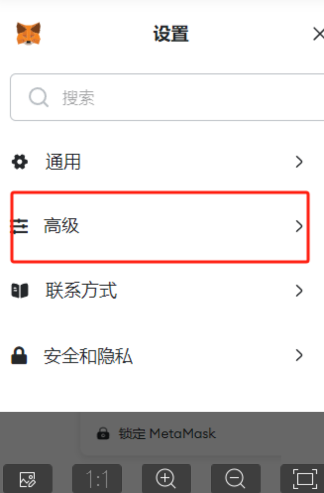

# 简易铭文攻略

> 最近铭文很火，很多人都想参与进来，此处为打铭文的最小主流方案，方便你了解他们说的打铭文是什么意思，过程很简单，别眨眼，和我一起打完你的第一个铭文。

铭文最近刮起了一波热潮，市场上出现了很多千倍，万倍的神话

很多人都想了解下其中的技术原理

此内容为社区中常见内容的整合和总结

仅供学习使用  
想学习更多内容加入群聊  
公众号「圆桌Labs」-「加入微信」

### 工具

一些工具的安装在[此处](../打铭文前的准备/README.md)

- 梯子
- 电脑
- 谷歌
- 钱包（小狐狸钱包、幻影钱包等）
- 推特
- 电报
- discord

## 初级版（小狐狸钱包举例）

铭文的原理就是在一个代币「代币的本质是一段代码」的一个特定区域写一段特定的文字。

我们可以通过在发送交易的时候附加这段文字来打铭文，所以整个操作就是一个有一点特殊的进行一笔交易，最简单的方式就是在钱包打铭文

### 所需准备

因为币圈有很多链，eth，bnb，shib，okt、polygon等很多链，每一种链都有对应的加密货币作为手续费，这部分手续费是支付给那些给你提供区块链服务的“矿工”（一群有很多电脑和显卡，能够提供算力的人，他们提供的算力越多，作为回报，给他们对应区块链的加密货币越多）

以下以BNB smart链为例，这条链需要bnb作为手续费支出，所以

1. 在交易所拿人民币购买bnb
2. u换成bnb，你想打的越多，就提的bnb越多
3. 将交易所中的bnb提到你的钱包中。

以上玩成了80%任务！

另外我们的最终目的就是需要有bnb在自己的钱包中，如果你在我们社群的话完全可以和群友购买，这样的话80%的工作分分钟就解决了。

赶快加入我们学习交流群吧「公众号：圆桌Labs」-「菜单：加入微信」

如果你没有自己的交易所，可以下载个

- [Binance/币安](https://accounts.binance.com/register?ref=190551860)
- [OKX](https://ouxyi.clinic/join/65267353)

接下来那20%，我们以BSC（bnb链的缩写）上的 bsci铭文 为例：（bsci已经过期了，只是简单举个例子，其他铭文的方式与这个类似）

1. 将钱包网络换为要打的链，此处为bsc链：
      

2. 这是bsci铭文在bsc链上的全部信息
   （你们应该经常看到这种字符串，这种就是铭文）：

    代码：
    ```data:,{"p":"bsc-20","op":"mint","tick":"bsci","amt":"1000"}```

    16进制：
    ```0x646174613a2c7b2270223a226273632d3230222c226f70223a226d696e74222c227469636b223a2262736369222c22616d74223a2231303030227d```

代码所表示的信息和以16进制表示的信息是一致的！

3. 开始铭刻，你钱包里必须要有bnb作为手续费，铭刻铭文一般都不会花费很多钱，只花手续费（但是也有一些特殊的铭文，需要花费很多钱去铭刻）（或者当时铭刻这个铭文的人太多，把bsc这条链给挤爆了，矿工提供的算力，不足以支撑那么大的信息数据，只能为手续费付出越多的人提供服务）

在开始铭刻前，你需要保证你能够输入16进制的信息，所以打开小狐狸钱包右上角的设置，选择高级，将显示16进制信息打开：

  

  


  


接着开始铭刻，点击发送：  

  

铭文一般都是自转，也就是将0个bnb，发送给自己，但是发送的过程中，要按照这个信息将上面的16进制填上：  

  

点击开始下一步，挥着先这个页面，点击  确认 ，他只会扣除一点点手续费：  

  

接着，会出现 待处理 ：  

  

然后已确认：  

  

恭喜你，已经成功铭刻一枚  bsci ，当然，我写这篇攻略的时候，但由于bsci铭文已经被铭刻完了，所以是无用功，各位也请注意。

当你开始铭刻铭文的时候，一定要去寻找 一个叫**“面板数据”**的网站，切记，这个网站千万不要用自己的钱包链接，但是你可以把自己的钱包地址复制出来，然后通过这个面板数据，查看你到底铭刻了多少次。

以这个bsci为例，如果我成功了，过0.5h左右，面板数据会显示我这个地址的数据位1。

面板数据我再截图举个例子，以FTM链的 fans铭文为例：  
[点击进入面板数据网址](https://dune.com/wonderful/polsinclude-contract-mint)  


接着钱包内换成ftm链，并且复制下来对应的钱包地址，这是你查询数据的关键：  

  
  


## 进阶版（专业的代打方式）

批量打得时候当然不会用钱包这样操作，以下是一个简单的代打实例

铭文方式一：基本铭文铭刻

1. 打开网址：[https://mct.xyz/ethscriber](https://mct.xyz/ethscriber)，这是一个用于批量铭刻铭文的网站。

2. 以 BSCI 铭文为例，复制以下代码：
```
{"p":"bsc-20","op":"mint","tick":"bsci","amt":"1000"}
```

3. 将复制的代码粘贴到网站上的相应位置。请注意，在该网站上不需要包含 `data:` 这一部分，其他网站可能会有所不同。  

  

4. 点击钱包弹出的确认按钮，开始铭刻铭文。请注意，根据链上的拥挤程度，可能会存在一定的失败概率。一般情况下，成功率约为 95%。


注意事项：
- 铭文操作可能会失败，具体成功与否取决于链上的状况。
- 铭文操作的成功率一般较高，但并不保证100%成功。
- 代打需要倒入私钥，安全风险高，建议用新号

学习交流群内会有一些大佬写的代打工具，很放心，而且有自己的服务器集群，群友使用可以打折。

想学习更多内容加入群聊  
公众号「圆桌Labs」-「加入微信」

目前刚好赶上 BSC 链官方铭文活动的一个热度机会，赔率增加，可以适当参与，或者没打过可以练手
https://twitter.com/BNBCHAIN/status/1732455232599212240


## 好用的铭文工具

- [OKX批量铸造铭文](https://mp.weixin.qq.com/s/-Qd8B1B_hDLBS3SWTMmKKg)
- 鼠大侠（自己百度）
- 自定义脚本（来群里瓢大佬的）

除此之外，每个新的链都有自己的打铭文方式，虽然整体大同小异但信息源很重要，学习交流群也会不断追更新的内容。

想学习更多内容加入群聊  
公众号「圆桌Labs」-「加入微信」
